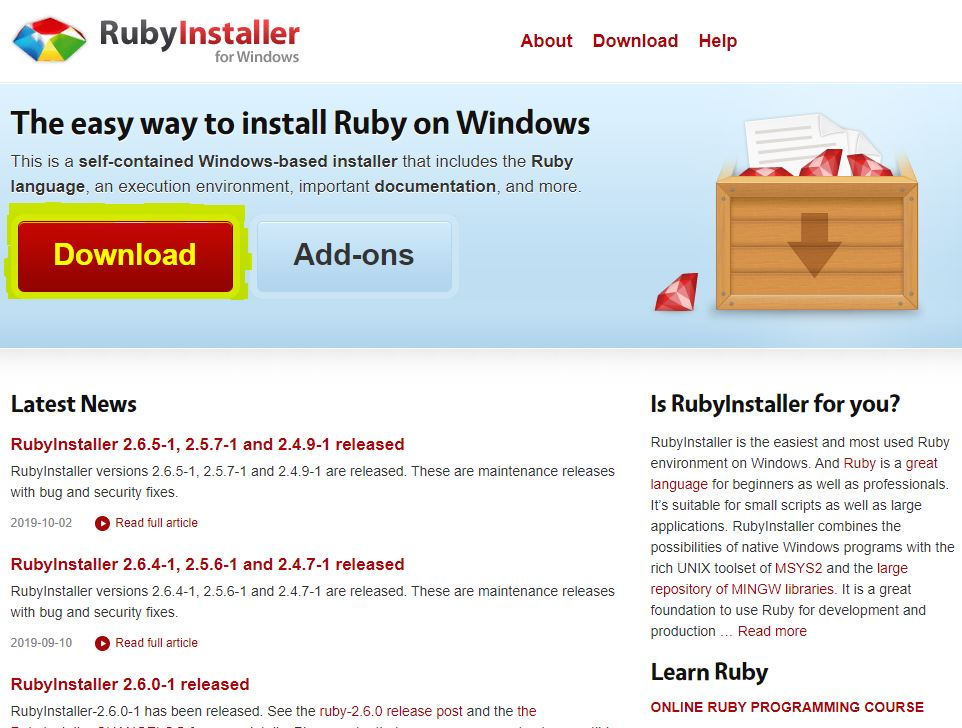

Web site를 제작할 때, 개발자들은 대부분 local환경에서 수정 및 보완을 하고 testing과정을 거친 후 배포를 진행한다.

나 또한 그러했다.

그렇다면 jekyll blog도 local환경에서 작업하는 것이 git develop branch에 계속 push를 하면서 제작하는 것보다 편하지 않을까?

다음 과정을 통하여 local환경에서 jekyll blog를 testing할 수 있는 환경설정 과정을 공유하고자 한다.

@mkl0819님의 블로그 포스팅을 참고하였다.
[mkl0819님의 포스팅](https://mkl0819.github.io/category/blog/2019-10-27-01-running-locally/)

## 1. ruby 설치하기

```
jekyll theme블로그가 ruby기반으로 제작되었기 때문에, ruby를 설치해야한다.
하단 Download버튼을 누르면 최신버전을 받을 수 있다.
```


[ruby download site](https://www.ruby-lang.org/ko/downloads/)




## 2. bundle 설치하기

ruby 설치가 완료되었다면, 루비 어플리케이션을 위한 일관된 환경을 관리해주는 bundle을 이용할 것이다.

먼저 본인의 PC에서 cmd창을 키고, blog path로 이동한다.

```
cd (path)
```
cd 명령어를 이용하면 path이동이 가능하다.

```js
//만약 D drive로 이동한다면
D:
```
만약, C드라이브가 아닌 공간이 아니라면 default drive인 C에서 다른 드라이브로의 이동을 위해 위와 같이 입력하여 이동이 가능하다.

path이동이 완료되었다면, 이제 bundle 설치를 들어갈것이다.

```
bundle install
```
보통은 이렇게 실행한 후 다음단계로 넘어간다.

하지만, 만약 3번 단계로 진행하여 server를 실행했음에도 error가 뜬다면 다시 돌아와서 다음의 절차를 실행해 보기 바란다.

### 추가 절차(error 잡기)
```
Bundler could not find compatible versions for gem "ruby ":
  In Gemfile:
    ruby

    jekyll was resolved to 3.8.3, which depends on
      jekyll-watch (~> 2.0) was resolved to 2.0.0, which depends on
        listen (~> 3.0) was resolved to 3.1.5, which depends on
          rb-inotify (~> 0.9, >= 0.9.7) was resolved to 0.9.10, which depends on
            ffi (>= 0.5.0, < 2) was resolved to 1.9.25, which depends on
              ruby  (< 2.6) x64-mingw32

Could not find gem 'ruby  (< 2.6)', which is required by gem 'ffi (>= 0.5.0, <
2)', in any of the relevant sources:
  the local ruby installation
```
나는 다음과 같은 error message를 cmd창에서 확인할 수 있었다.

이는 jekyll blog가 최신 버전의 bundle 또는 ruby version과 맞지 않기 때문에 발생하는 error라고 판단하고, version을 맞춰주는 명령어를 입력하여 해결했다.

```
gem update --system
gem update
bundle update
```
위과 같은 순서로 cmd창에 입력하면 된다.
각 명령마다 일정의 시간이 소요되기 때문에, enter를 치고, 다른 일을 하고 있는 것을 추천한다.

## 3. bundle을 이용한 ruby blog 실행하기
```
bundle exec jekyll serve
```
위의 명령어를 실행하면, 127.0.0.1:4000에서 blog가 실행된다.

모두 알다시피, **"127.0.0.1의 ip"**는 자신의 localhost를 의미하고, **":4000"**은 해당 ip의 4000번포트를 통해 접속이 가능하다는 것을 의미한다.

따라서, **"http://localhost:4000/"**를 주소창에 입력하면 자신의 블로그가 뜨는 것을 확인할 수 있을 것이다.
